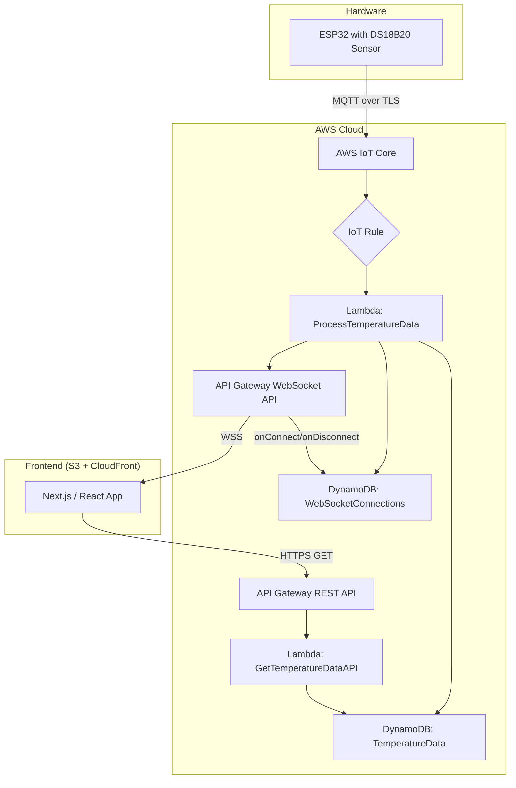

# Real-Time IoT Temperature Dashboard with AWS Serverless & Next.js


This project is a complete, end-to-end demonstration of a modern Internet of Things (IoT) solution. It captures temperature data from a physical ESP32 microcontroller and visualizes it on a dynamic, real-time web dashboard. The entire cloud infrastructure is built on a serverless AWS architecture, ensuring scalability, low cost, and high availability, while the frontend is a responsive Next.js application automatically deployed via GitHub Actions.

**[>> View the Live Demo <<](YOUR_CLOUDFRONT_URL_HERE)**

<!--  -->

## ✨ Key Features

- **Real-Time Data Ingestion:** An ESP32 microcontroller with a DS18B20 sensor reads and transmits temperature data every 30 seconds
- **Secure & Scalable Backend:** A fully serverless backend built on AWS handles data ingestion, processing, storage, and delivery
- **Dynamic Frontend:** A responsive frontend built with Next.js and React that displays historical data and receives live updates
- **Live Updates via WebSockets:** The dashboard updates instantly with new temperature readings without needing to refresh the page
- **Historical Data View:** On initial load, the application fetches and displays the last 24 hours of temperature data
- **Internationalization (i18n):** The user interface supports both English (US) and Portuguese (BR), managed by a Zustand state store
- **Automated Deployments:** A CI/CD pipeline using GitHub Actions automatically builds and deploys the Next.js frontend to AWS S3 and CloudFront on every push to the `main` branch

## 🏗️ Solution Architecture

The architecture is designed to be event-driven, decoupled, and highly scalable, following modern cloud-native best practices.



**Data Flow Explained:**

1. **Ingestion:** The ESP32 device reads the temperature and securely publishes a JSON payload to a specific topic on AWS IoT Core using the MQTT protocol
2. **Routing:** An IoT Rule is configured to listen to this topic. When a message arrives, it triggers the `ProcessTemperatureData` Lambda function
3. **Processing & Storage:** This primary Lambda function:
   - Saves the temperature record (device_id, timestamp, temperature) into the `TemperatureData` DynamoDB table
   - Scans the `WebSocketConnections` table to get a list of all currently connected clients
   - Uses the API Gateway Management API to push the new temperature data to every active client via the WebSocket API
4. **Historical Data Request:** When a user first opens the web application, the Next.js/React frontend makes an HTTPS request to the API Gateway REST API (`/temperatures`)
5. **Data Retrieval:** This request triggers the `GetTemperatureDataAPI` Lambda, which queries the `TemperatureData` DynamoDB table for the last 24 hours of data and returns it to the frontend
6. **Real-Time Connection:** Simultaneously, the frontend establishes a persistent connection to the API Gateway WebSocket API. API Gateway manages this connection's lifecycle, triggering Lambdas to add/remove the `connectionId` from the `WebSocketConnections` table

## 🛠️ Tech Stack

### Hardware

- **Microcontroller:** ESP32
- **Sensor:** DS18B20

### Cloud (AWS)

- **AWS IoT Core:** For MQTT message ingestion and routing
- **AWS Lambda:** For serverless compute (data processing, API logic)
- **Amazon DynamoDB:** NoSQL database for time-series data storage and WebSocket connection management
- **Amazon API Gateway:** For creating and managing both RESTful and WebSocket APIs
- **Amazon S3:** For static website hosting
- **Amazon CloudFront:** For global content delivery (CDN) and SSL/TLS termination
- **AWS IAM:** For secure permission management

### Frontend

- **Framework:** Next.js with React
- **Styling:** Tailwind CSS
- **Charting:** Chart.js with `react-chartjs-2` wrapper
- **State Management:** Zustand (for i18n)
- **Real-Time:** react-use-websocket

### DevOps

- **CI/CD:** GitHub Actions for automated deployments to AWS

## 🧠 Challenges & Key Learnings

- **Time-Series Data Modeling in DynamoDB:** Implemented a composite primary key pattern (`device_id` as Partition Key, `timestamp` as Sort Key) to enable efficient time-range queries, a crucial task for a non-relational database

- **Serverless WebSocket Architecture:** Designed and implemented a real-time system without a persistent server. This involved using API Gateway to manage the connection lifecycle and DynamoDB to maintain the state of active connections, which the data processing Lambda could then query to broadcast messages

- **End-to-End Security:** Configured secure communication from the device to the cloud (MQTT over TLS) and from the cloud to the browser (HTTPS/WSS via CloudFront and API Gateway). Set up granular IAM roles and secure GitHub Secrets for the CI/CD pipeline

- **CI/CD Automation:** Built a GitHub Actions workflow to automate the build, static export (`next export`), and deployment process, including syncing files to S3 and invalidating the CloudFront cache to ensure users always see the latest version

## 🚀 Getting Started

This project is a [Next.js](https://nextjs.org) project bootstrapped with [`create-next-app`](https://nextjs.org/docs/app/api-reference/cli/create-next-app).

### Prerequisites

- Node.js 18+
- AWS Account with configured credentials
- ESP32 device with DS18B20 sensor

### Installation

1. Clone the repository:

```bash
git clone https://github.com/your-username/iot-temperature-dashboard.git
cd iot-temperature-dashboard
```

2. Install dependencies:

```bash
npm install
```

3. Run the development server:

```bash
npm run dev
```

5. Open [http://localhost:3000](http://localhost:3000) with your browser to see the result

You can start editing the page by modifying `app/page.tsx`. The page auto-updates as you edit the file.

### Deployment

The project includes automated deployment via GitHub Actions. Push to the `main` branch to trigger automatic deployment to AWS.

## 📄 License

This project is licensed under the MIT License - see the [LICENSE](LICENSE) file for details.

## 👤 Author

**Gabriel Baptista**

- [LinkedIn](https://www.linkedin.com/in/gabriel-baptista-cerqueira)
- [GitHub](https://github.com/gbcbaptista)
- [Portfolio](https://gabriel-baptista.dev/)
